# 🏗️ Kiến Trúc Hệ Thống: ESP32 Smart Watch × AI Productivity Ecosystem

> **Dự án hiện tại**: E-ink Clock (Flutter + FastAPI + MongoDB + ESP32 TFT)
> **Mục tiêu nâng cấp**: Thêm AI Engine + Digital Twin + Context-Aware Productivity

---

## 📐 1. System Architecture Tổng Thể

```mermaid
graph TB
    subgraph HARDWARE["⌚ ESP32 Hardware Layer"]
        ESP["ESP32 DevKit V1<br/>TFT ILI9486 Touch<br/>RTC DS3231 · Buzzer · I2S"]
        FW["Firmware Layers<br/>pomodoro_engine.cpp<br/>timer_engine.cpp<br/>Bluetooth A2DP"]
    end

    subgraph MOBILE["📱 Flutter Mobile App"]
        direction TB
        UI_HOME["Home Screen"]
        UI_POMODORO["Adaptive Pomodoro"]
        UI_AI["AI Assistant (Chat/Voice)"]
        UI_COACH["Productivity Coach"]
        UI_TWIN["Digital Twin Profile"]
        UI_CONTEXT["Context Dashboard"]
        UI_DESIGN["Watch Face Market"]
        UI_ALARM["Smart Alarm & Calendar"]
        UI_MUSIC["Music Control"]
    end

    subgraph GATEWAY["🔌 Communication Layer"]
        BLE["BLE (Bluetooth Serial)<br/>Real-time sync"]
        MQTT["MQTT over WiFi<br/>pub/sub events"]
        REST["REST API<br/>HTTP/HTTPS"]
        WS["WebSocket<br/>AI Live Chat"]
    end

    subgraph BACKEND["⚙️ FastAPI Backend (Python)"]
        direction TB
        API_GW["API Gateway / Router"]
        AUTH["Auth Service<br/>JWT + OAuth2"]
        POMO_SVC["Pomodoro Service"]
        SCHEDULE_SVC["Schedule Service"]
        MARKET_SVC["Watch Face Market"]
        AI_SVC["AI Orchestrator"]
        CONTEXT_SVC["Context Service<br/>Weather · Calendar · Location"]
        MQTT_BROKER["MQTT Broker<br/>Mosquitto / EMQX"]
    end

    subgraph AI_ENGINE["🧠 AI Engine Layer"]
        direction TB
        COACH["AI Productivity Coach<br/>LLM: Gemini / GPT-4"]
        ADAPTIVE["Adaptive Pomodoro<br/>Reinforcement Learning"]
        TWIN["Digital Twin Builder<br/>User Profiling Model"]
        BURNOUT["Burnout Detector<br/>Anomaly Detection · LSTM"]
        PATTERN["Work Pattern Mining<br/>K-Means Clustering"]
        PREDICT["Predictive Scheduling<br/>Time-Series LSTM/Prophet"]
        LIVE["AI Live Assistant<br/>RAG + LLM Streaming"]
    end

    subgraph DB["🗄️ Data Layer"]
        MONGO["MongoDB Atlas<br/>Main Database"]
        REDIS["Redis<br/>Sessions · Cache · PubSub"]
        VECTOR["Qdrant / Chroma<br/>Vector DB for RAG"]
        TIMESERIES["TimescaleDB / InfluxDB<br/>Productivity Logs (time-series)"]
    end

    subgraph EXTERNAL["🌐 External APIs"]
        WEATHER["OpenWeatherMap API"]
        GCAL["Google Calendar API"]
        MAPS["Google Maps / IP Geolocation"]
        GEMINI["Google Gemini API / OpenAI"]
    end

    ESP <-->|BLE Serial| BLE
    ESP <-->|WiFi MQTT| MQTT_BROKER
    MOBILE <-->|BLE| BLE
    MOBILE <-->|REST/WS| API_GW
    BLE --> GATEWAY
    MQTT <--> MQTT_BROKER
    API_GW --> AUTH
    API_GW --> POMO_SVC
    API_GW --> SCHEDULE_SVC
    API_GW --> MARKET_SVC
    API_GW --> AI_SVC
    API_GW --> CONTEXT_SVC
    AI_SVC --> COACH
    AI_SVC --> ADAPTIVE
    AI_SVC --> TWIN
    AI_SVC --> BURNOUT
    AI_SVC --> PATTERN
    AI_SVC --> PREDICT
    AI_SVC --> LIVE
    COACH --> GEMINI
    LIVE --> GEMINI
    CONTEXT_SVC --> WEATHER
    CONTEXT_SVC --> GCAL
    CONTEXT_SVC --> MAPS
    AI_ENGINE --> DB
    BACKEND --> MONGO
    BACKEND --> REDIS
    LIVE --> VECTOR
    BURNOUT --> TIMESERIES
    PREDICT --> TIMESERIES
```



---

## 🛠️ 2. Tech Stack Hoàn Chỉnh

### 2.1 IoT / Firmware (ESP32)

| Thành phần             | Công nghệ                          | Lý do chọn                               |
| ------------------------ | ------------------------------------ | ------------------------------------------ |
| **Framework**      | Arduino (PlatformIO)                 | Đang dùng, ổn định với MCUFRIEND_kbv |
| **Display**        | MCUFRIEND_kbv + Adafruit GFX         | Tương thích ILI9486 TFT Touch hiện có |
| **RTC**            | RTClib (DS3231)                      | Đang dùng, độ chính xác cao          |
| **Bluetooth Data** | `BluetoothSerial` (BT Classic SPP) | Đang dùng, phù hợp gửi JSON commands  |
| **Audio**          | `BluetoothA2DPSink`                | Đang dùng cho Music Control              |
| **WiFi**           | `WiFi.h` + `PubSubClient`        | Thêm mới: kết nối MQTT cho AI sync     |
| **JSON**           | ArduinoJSON                          | Parse lệnh JSON từ App                   |
| **OTA**            | `ArduinoOTA`                       | Firmware update qua WiFi                   |
| **Protocol Mới**  | MQTT (PubSubClient)                  | Pub/Sub real-time với Backend             |

### 2.2 Mobile App (Flutter)

| Thành phần               | Package                              | Ghi chú                                |
| -------------------------- | ------------------------------------ | --------------------------------------- |
| **State Management** | `flutter_bloc` / `riverpod`      | Tách biệt logic khỏi UI              |
| **BLE / Bluetooth**  | `flutter_bluetooth_serial`         | Kết nối ESP32 BT Classic SPP          |
| **HTTP Client**      | `dio` + `retrofit`               | REST API calls có interceptor          |
| **WebSocket**        | `web_socket_channel`               | AI Live Chat streaming                  |
| **Local DB**         | `drift` (SQLite)                   | Lưu session offline                    |
| **Charts**           | `fl_chart`                         | Biểu đồ Digital Twin, Pomodoro stats |
| **Calendar**         | `table_calendar` + Google Calendar | Lịch + Predictive Scheduling           |
| **Notifications**    | `flutter_local_notifications`      | Smart Alarm, Burnout alert              |
| **Location**         | `geolocator`                       | Context-aware productivity              |
| **Audio**            | `just_audio`                       | Music control UI                        |
| **AI Chat UI**       | Custom Chat Widget                   | AI Live Assistant UI                    |
| **Animations**       | `lottie` + `rive`                | Micro-animations premium                |

### 2.3 Backend (Python FastAPI)

| Module                    | Tech                          | Ghi chú                          |
| ------------------------- | ----------------------------- | --------------------------------- |
| **Framework**       | FastAPI ≥ 0.100              | *Đang dùng*                   |
| **Database Driver** | Motor (async MongoDB)         | *Đang dùng*                   |
| **Auth**            | `python-jose` + `passlib` | JWT Authentication                |
| **MQTT Broker**     | EMQX (Docker)                 | Thêm mới: IoT messaging         |
| **MQTT Client**     | `aiomqtt`                   | Async MQTT pub/sub                |
| **Task Queue**      | Celery + Redis                | AI training jobs, scheduled tasks |
| **WebSocket**       | FastAPI WebSocket             | AI Live streaming                 |
| **Cache**           | Redis (`aioredis`)          | Session, AI response cache        |
| **Scheduler**       | APScheduler                   | Predictive scheduling engine      |
| **HTTP Client**     | `httpx`                     | Gọi Weather API, Google APIs     |
| **Vector Search**   | `qdrant-client`             | RAG cho AI Live Assistant         |

### 2.4 AI / ML Engine

| Tính năng                     | Model / Framework                   | Input Data                                      |
| ------------------------------- | ----------------------------------- | ----------------------------------------------- |
| **AI Productivity Coach** | Google Gemini 1.5 Pro (LLM)         | Work logs, task type, time-of-day               |
| **Adaptive Pomodoro**     | Reinforcement Learning (Q-Learning) | Concentration Score, completion rate            |
| **Digital Twin Builder**  | Sklearn (PCA + KMeans + LDA)        | Historical sessions (6+ months)                 |
| **Burnout Detector**      | LSTM Autoencoder (TensorFlow/Keras) | Heart-rate proxy, overwork hours, missed breaks |
| **Work Pattern Mining**   | K-Means + DBSCAN (Scikit-learn)     | Session timestamps, task labels                 |
| **Predictive Scheduling** | Prophet (Facebook) / LSTM           | Past 90-day work patterns                       |
| **AI Live Assistant**     | RAG + Gemini 1.5 Flash              | Personal knowledge base (Qdrant)                |
| **Context Awareness**     | Rule-based Engine + LLM             | Weather, calendar density, location             |

### 2.5 Database Architecture

| DB                               | Vai trò         | Collections / Tables                                     |
| -------------------------------- | ---------------- | -------------------------------------------------------- |
| **MongoDB Atlas**          | Main app data    | users, pomodoro_sessions, schedules, watch_faces, alarms |
| **TimescaleDB / InfluxDB** | Time-series logs | productivity_metrics (hypertable by time)                |
| **Redis**                  | Cache + PubSub   | sessions, ai_cache, mqtt_relay                           |
| **Qdrant**                 | Vector store     | user_knowledge_base (cho RAG)                            |

---

## 🔄 3. Data Flow Diagrams

### 3.1 Adaptive Pomodoro Flow

```
[User starts Pomodoro on App]
        │
        ▼
[Flutter] ──BLE JSON──► [ESP32] displays timer, vibrates on phase change
        │
        ▼
[FastAPI /api/v1/pomodoro/start]
        │
        ▼
[Redis] saves session state (real-time sync)
        │
        ▼
[AI Engine: Q-Learning Agent]
 - State: (hour_of_day, previous_completion_rate, concentration_score)
 - Action: (work_duration, break_duration)
 - Reward: completion_rate * focus_score - interruption_penalty
        │
        ▼
[Next session: AI returns adjusted durations]
        │
        ▼
[App + ESP32 updated with new cycle]
```

### 3.2 Burnout Detection Flow

```
[Daily work log saved] ──► [TimescaleDB]
                                │
                    ┌───────────┴────────────┐
                    ▼                        ▼
        [LSTM reads 30-day window]   [Rule engine checks]
        working_hours_per_day        missed_breaks > threshold
        break_skip_rate              overtime_sessions > 5/week
        task_completion_rate         focus_score declining trend
                    │                        │
                    └──────────┬─────────────┘
                               ▼
                   [Burnout Risk Score 0-100]
                        │            │
                   Score < 40    Score ≥ 70
                       │              │
                   [All good]   [ALERT sent to App]
                                 + ESP32 vibrates
                                 + AI Coach message
```

### 3.3 Context-Aware Productivity Flow

```
[Every morning 6:00 AM - Scheduled Job]
        │
        ├──► Fetch Weather (OpenWeatherMap)
        ├──► Fetch Calendar events (Google Calendar API)
        └──► Get last known Location (cached)
        │
        ▼
[Context Aggregator]
{
  "temperature": 38,
  "weather": "sunny",
  "calendar_density": "heavy", // 5+ meetings today
  "location_type": "home",
  "user_profile": {...}  // Digital Twin data
}
        │
        ▼
[Gemini LLM Prompt Engineering]
"Based on this context, generate productivity advice..."
        │
        ▼
[AI Coach Push Notification to App + ESP32 scroll message]
```

---

## 🗄️ 4. Database Schema

### 4.1 Collection: `users`

```json
{
  "_id": "ObjectId",
  "email": "string",
  "password_hash": "string",
  "display_name": "string",
  "timezone": "Asia/Ho_Chi_Minh",
  "created_at": "datetime",
  "preferences": {
    "theme": "dark",
    "notification_enabled": true,
    "work_start_hour": 8,
    "work_end_hour": 17
  },
  "digital_twin": {
    "productivity_profile": "deep_worker",  // Từ Clustering
    "focus_score_avg": 72.5,
    "optimal_work_duration": 35,
    "optimal_break_duration": 8,
    "peak_hours": [9, 10, 14, 15],
    "burnout_risk_score": 28.0,
    "last_updated": "datetime"
  }
}
```

### 4.2 Collection: `pomodoro_sessions`

```json
{
  "_id": "ObjectId",
  "user_id": "ObjectId",
  "started_at": "datetime",
  "ended_at": "datetime",
  "phase": "work | break | long_break",
  "planned_duration_s": 1500,
  "actual_duration_s": 1423,
  "was_completed": true,
  "interruptions": 2,
  "task_label": "coding | reading | meeting | ...",
  "concentration_score": 85.0,  // 0-100
  "ai_recommended": true,
  "ai_params": {
    "work_duration": 35,
    "break_duration": 8,
    "reason": "High focus score detected in morning window"
  },
  "source": "app | watch"
}
```

### 4.3 Collection: `productivity_logs` (TimescaleDB / InfluxDB)

```
time           | user_id | metric_name           | value | tags
---------------|---------|----------------------|-------|------------------
2026-09-18T08  | usr_001 | focus_score          | 85.2  | task=coding
2026-09-18T08  | usr_001 | work_duration_actual | 1800  | phase=work
2026-09-18T08  | usr_001 | break_skipped        | 0     | -
2026-09-18T09  | usr_001 | focus_score          | 61.0  | task=meeting
2026-09-18T09  | usr_001 | interruptions        | 3     | -
```

### 4.4 Collection: `context_snapshots`

```json
{
  "_id": "ObjectId",
  "user_id": "ObjectId",
  "captured_at": "datetime",
  "weather": {
    "temp_c": 38.2,
    "condition": "sunny",
    "humidity": 78
  },
  "calendar": {
    "events_today": 4,
    "next_event_in_min": 45,
    "density": "heavy"
  },
  "location": {
    "type": "home | office | commute | other",
    "lat": 10.762622,
    "lon": 106.660172
  },
  "ai_advice": "string",
  "advice_delivered": true
}
```

### 4.5 Collection: `schedules` (đang có, mở rộng)

```json
{
  "_id": "ObjectId",
  "user_id": "ObjectId",
  "title": "string",
  "type": "alarm | reminder | focus_block | meeting",
  "scheduled_at": "datetime",
  "repeat": "none | daily | weekly",
  "repeat_days": [1, 3, 5],
  "ai_generated": false,  // true nếu do Predictive Scheduling tạo
  "synced_to_watch": true,
  "notification_methods": ["app", "watch_vibrate", "buzzer"]
}
```

---

## 🔌 5. API Endpoints

### Group 1: Auth

```
POST   /api/v1/auth/register
POST   /api/v1/auth/login          → JWT token
POST   /api/v1/auth/refresh
GET    /api/v1/auth/me
```

### Group 2: Pomodoro (mở rộng từ existing)

```
POST   /api/v1/pomodoro/start           → Start session, AI returns params
PUT    /api/v1/pomodoro/{id}/complete   → Mark done, update concentration_score
PUT    /api/v1/pomodoro/{id}/interrupt  → Log interruption
GET    /api/v1/pomodoro/sessions        → History with pagination
GET    /api/v1/pomodoro/stats           → Weekly/monthly analytics
GET    /api/v1/pomodoro/ai-recommend    → Get AI-recommended next cycle duration
```

### Group 3: AI Features

```
GET    /api/v1/ai/coach/daily-advice    → AI Productivity Coach message
GET    /api/v1/ai/digital-twin/profile  → Xem Digital Twin profile
POST   /api/v1/ai/digital-twin/update   → Trigger profile recalculation
GET    /api/v1/ai/burnout/risk          → Burnout risk score
GET    /api/v1/ai/schedule/predict      → Predictive Scheduling suggestions
POST   /api/v1/ai/pattern/analyze       → Trigger Work Pattern Mining
WS     /api/v1/ai/chat                  → AI Live Assistant (WebSocket streaming)
```

### Group 4: Context

```
GET    /api/v1/context/today            → Weather + Calendar + Location summary
POST   /api/v1/context/location         → Update user location
GET    /api/v1/context/weather          → Current weather data
```

### Group 5: ESP32 / IoT

```
POST   /api/v1/device/sync-pomodoro     → Push Pomodoro state to MQTT → ESP32
POST   /api/v1/device/sync-alarm        → Push alarm settings to ESP32
POST   /api/v1/device/watchface/upload  → OTA upload watch face data
GET    /api/v1/device/status            → ESP32 online/offline status
```

### Group 6: Existing (đang có)

```
GET/POST  /api/v1/market/*              → Watch Face Market
GET/POST  /api/v1/schedules/*           → Schedule CRUD
GET/PUT   /api/v1/firmware/*            → OTA Firmware
```

---

## 📱 6. Flutter App - Screen Map

```
App
├── 🏠 Home Dashboard
│   ├── Current Pomodoro State (synced with ESP32)
│   ├── Daily AI Coach Card
│   ├── Burnout Risk Widget
│   └── Context Snapshot (Weather + Calendar)
│
├── 🍅 Adaptive Pomodoro
│   ├── AI-Recommended cycle display
│   ├── Manual override option
│   ├── Live sync với ESP32
│   └── Session history + Focus Score chart
│
├── 🧠 AI Productivity Hub
│   ├── AI Productivity Coach (daily advice)
│   ├── Digital Twin Profile (radar chart: Focus/Break/Stress/Efficiency)
│   ├── Work Pattern Mining (heatmap, cluster label)
│   ├── Burnout Risk Gauge
│   └── Predictive Schedule Suggestions
│
├── 💬 AI Live Assistant
│   ├── Chat interface (streaming)
│   ├── Voice input (STT)
│   └── Voice output (TTS)
│
├── 📅 Smart Calendar
│   ├── Schedule CRUD
│   ├── AI auto-generated focus blocks
│   ├── Sync to Google Calendar
│   └── Alarm management → sync to ESP32
│
├── 🎨 Watch Face Market (đang có)
│   ├── Browse themes
│   ├── Apply → OTA to ESP32
│   └── Custom color settings
│
├── ⚙️ General Settings (đang có)
│   ├── Pomodoro defaults
│   ├── Theme settings
│   ├── BLE connection manager
│   └── Notification preferences
│
└── 🎵 Music Control
    └── BT A2DP control panel (Play/Pause/Skip)
```

---

## 🧠 7. AI Strategy Chi Tiết

### 7.1 Adaptive Pomodoro - Q-Learning Agent

```python
# State space
state = (
    hour_of_day,          # 0-23
    day_of_week,          # 0-6
    prev_concentration,   # low/medium/high
    prev_completion_rate, # 0-100
    break_was_skipped,    # bool
    task_type             # coding/reading/meeting/...
)

# Action space
action = (work_minutes, break_minutes)
# Possible: [(20,5), (25,5), (30,7), (35,8), (40,10), (45,12), (50,15)]

# Reward function
def reward(session):
    r = session.completion_rate * 0.5
    r += session.concentration_score * 0.3
    r -= session.interruptions * 5
    r -= 10 if session.break_was_skipped else 0
    return r

# Q-table updated after each session
Q[state][action] = Q[state][action] + alpha * (
    reward + gamma * max(Q[next_state]) - Q[state][action]
)
```

### 7.2 Burnout Detection - LSTM Autoencoder

```
Input (30-day rolling window, daily features):
  - avg_work_hours_per_day
  - break_skip_rate
  - avg_concentration_score
  - task_completion_rate
  - sessions_per_day
  - overtime_sessions (after 6PM)
  - weekend_work_flag

Model: LSTM(64) → LSTM(32) [Encoder]
     → RepeatVector(30)
     → LSTM(32) → LSTM(64) [Decoder]
     → Dense(7) [Reconstruction]

Anomaly Score = MSE(input, reconstructed)
Burnout Risk = sigmoid(anomaly_score) * 100
```

### 7.3 Digital Twin - User Profiling

```
Features collected (after 3+ months):
  - peak_productive_hours (histogram)
  - preferred_task_type (distribution)
  - avg_focus_score_by_context
  - break_behavior (compliance rate)
  - recovery_speed (how fast focus restores after break)

Pipeline:
  1. StandardScaler → normalize features
  2. PCA(n=5) → dimensionality reduction  
  3. KMeans(k=4) → cluster assignment:
     │  Cluster 0: "Deep Worker" (long focus, rare breaks)
     │  Cluster 1: "Sprinter" (short intense bursts)
     │  Cluster 2: "Flexible Worker" (variable patterns)
     └  Cluster 3: "Struggling" (low scores, high burnout risk)
  4. LLM generates personalized profile description + recommendations
```

---

## 🗺️ 8. Roadmap Triển Khai

### Phase 1: MVP AI Foundation (4-6 tuần)

```
✅ Có sẵn: FastAPI, Flutter, MongoDB, Pomodoro Engine ESP32
🔨 Thêm mới:
  □ User Auth (JWT)
  □ TimescaleDB setup + ProductivityLog model
  □ Adaptive Pomodoro API (Q-Learning basic)
  □ Flutter: Pomodoro screen mới với AI recommendation display
  □ ESP32: MQTT client kết nối Backend
  □ Context API (Weather integration)
```

### Phase 2: Core AI Features (6-8 tuần)

```
  □ AI Productivity Coach (Gemini API + daily advice)
  □ Burnout Detection (LSTM model training + API)
  □ Work Pattern Mining (K-Means clustering)
  □ Digital Twin Profile v1 (basic profiling)
  □ Flutter: AI Hub screens (coach, burnout gauge, pattern heatmap)
  □ Smart Calendar với AI-generated focus blocks
  □ Predictive Scheduling (Prophet model)
```

### Phase 3: Advanced AI & Polish (4-6 tuần)

```
  □ AI Live Assistant (RAG + WebSocket streaming)
  □ Digital Twin v2 (full profiling + LLM descriptions)
  □ Context-Aware Productivity (Calendar + Location integration)
  □ Predictive Scheduling v2 (Google Calendar sync)
  □ Flutter: Voice input/output cho AI Chat
  □ ESP32: Display AI advice as scrolling text
  □ Burnout alert → ESP32 special animation + vibration
```

### Phase 4: Scale & Production (ongoing)

```
  □ Docker Compose full stack deployment
  □ CI/CD pipeline
  □ Model retraining pipeline (MLflow)
  □ Multi-user Digital Twin with federated learning
  □ ESP32 OTA firmware auto-update
```

---

## 💻 9. Code Boilerplate Mẫu

### 9.1 Adaptive Pomodoro - Python Backend

```python
# backend/application/ai/adaptive_pomodoro_agent.py
import numpy as np
import json
from typing import Tuple

ACTIONS = [(20, 5), (25, 5), (30, 7), (35, 8), (40, 10), (45, 12), (50, 15)]

class AdaptivePomodoroAgent:
    """
    Q-Learning agent để tự động điều chỉnh chu kỳ Pomodoro
    dựa trên Concentration Score và lịch sử session
    """
    def __init__(self, alpha=0.1, gamma=0.9, epsilon=0.15):
        self.alpha = alpha      # Learning rate
        self.gamma = gamma      # Discount factor
        self.epsilon = epsilon  # Exploration rate
        self.q_table = {}       # state -> [q_value per action]

    def _encode_state(self, hour: int, concentration: float,
                      completion_rate: float, break_skipped: bool,
                      task_type: str) -> str:
        """Discretize & encode state thành string key"""
        hour_bin = hour // 4          # 0-5 (6 bins)
        conc_bin = int(concentration // 34)   # 0=low, 1=med, 2=high
        comp_bin = int(completion_rate // 50) # 0=low, 1=high
        return f"{hour_bin}_{conc_bin}_{comp_bin}_{int(break_skipped)}_{task_type}"

    def _get_q(self, state: str) -> list:
        if state not in self.q_table:
            self.q_table[state] = [0.0] * len(ACTIONS)
        return self.q_table[state]

    def recommend(self, hour: int, concentration_score: float,
                  completion_rate: float, break_skipped: bool,
                  task_type: str = "general") -> dict:
        """
        Recommend work/break duration cho phiên tiếp theo.
        Returns:
            {"work_min": int, "break_min": int, "reason": str}
        """
        state = self._encode_state(hour, concentration_score,
                                   completion_rate, break_skipped, task_type)
        q_vals = self._get_q(state)

        # Epsilon-greedy: explore vs exploit
        if np.random.random() < self.epsilon:
            action_idx = np.random.randint(len(ACTIONS))
        else:
            action_idx = int(np.argmax(q_vals))

        work_min, break_min = ACTIONS[action_idx]

        # Generate human-readable reason
        if concentration_score >= 70:
            reason = f"Điểm tập trung cao ({concentration_score:.0f}/100) → Tăng lên {work_min} phút làm việc"
        elif concentration_score <= 35:
            reason = f"Điểm tập trung thấp ({concentration_score:.0f}/100) → Giảm xuống {work_min} phút để phục hồi"
        else:
            reason = f"Hiệu suất bình thường → Giữ chu kỳ {work_min}/{break_min} phút"

        return {"work_min": work_min, "break_min": break_min,
                "reason": reason, "state": state, "action_idx": action_idx}

    def update(self, state: str, action_idx: int, reward: float,
               next_state: str):
        """Update Q-table sau khi session kết thúc"""
        q_curr = self._get_q(state)
        q_next = self._get_q(next_state)
        q_curr[action_idx] += self.alpha * (
            reward + self.gamma * max(q_next) - q_curr[action_idx]
        )

    @staticmethod
    def calculate_reward(completion_rate: float, concentration_score: float,
                         interruptions: int, break_skipped: bool) -> float:
        """Tính reward sau mỗi phiên Pomodoro"""
        reward = (completion_rate / 100) * 50
        reward += (concentration_score / 100) * 40
        reward -= interruptions * 5
        reward -= 15 if break_skipped else 0
        return max(-50, min(100, reward))  # Clamp to [-50, 100]
```

### 9.2 ESP32 MQTT + Pomodoro Sync (C++)

```cpp
// Thêm vào Esp32Pj.ino hoặc mqtt_client.cpp
#include <WiFi.h>
#include <PubSubClient.h>
#include <ArduinoJson.h>

// ==========================================
// CẤU HÌNH MQTT & WiFi
// ==========================================
const char* WIFI_SSID     = "YOUR_WIFI_SSID";
const char* WIFI_PASSWORD  = "YOUR_WIFI_PASS";
const char* MQTT_BROKER   = "192.168.1.x";   // IP Backend server
const int   MQTT_PORT      = 1883;
const char* DEVICE_ID      = "esp32_watch_01";

// Topics
const char* TOPIC_POMO_CMD   = "watch/pomodoro/command";  // App → ESP32
const char* TOPIC_POMO_STATE = "watch/pomodoro/state";    // ESP32 → App
const char* TOPIC_ALARM      = "watch/alarm/trigger";     // Backend → ESP32
const char* TOPIC_AI_MSG     = "watch/ai/message";        // Backend → ESP32 (scroll text)

WiFiClient wifiClient;
PubSubClient mqttClient(wifiClient);

// ==========================================
// MQTT CALLBACK - Nhận lệnh từ App/Backend
// ==========================================
void mqttCallback(char* topic, byte* payload, unsigned int length) {
    String msg;
    for (unsigned int i = 0; i < length; i++) msg += (char)payload[i];

    StaticJsonDocument<256> doc;
    DeserializationError err = deserializeJson(doc, msg);
    if (err) return;

    // Nhận lệnh Pomodoro từ App
    if (String(topic) == TOPIC_POMO_CMD) {
        const char* action = doc["action"];
        if (strcmp(action, "start") == 0) {
            pomoWorkDuration  = doc["work_min"].as<int>() * 60;
            pomoBreakDuration = doc["break_min"].as<int>() * 60;
            // Trigger Pomodoro start
            pomoPhase = PHASE_WORK;
            currentState = MODE_POMODORO;
            stateChanged = true;
            beepBuzzer(2, 200, 800); // 2 beeps = start signal
        }
        else if (strcmp(action, "stop") == 0) {
            currentState = MODE_CLOCK;
            stateChanged = true;
        }
    }

    // Nhận cảnh báo từ Backend (burnout, alarm)
    if (String(topic) == TOPIC_ALARM) {
        const char* type = doc["type"];
        if (strcmp(type, "alarm") == 0) {
            beepBuzzer(5, 500, 1000);
        } else if (strcmp(type, "burnout_warning") == 0) {
            beepBuzzer(3, 300, 600);
            // Hiển thị text cảnh báo trên màn hình
            displayScrollText("⚠ NGHỈ NGƠI ĐI BẠN ƠI!", C_RED);
        }
    }

    // Nhận tin nhắn AI (scroll trên màn hình đồng hồ)
    if (String(topic) == TOPIC_AI_MSG) {
        String text = doc["text"].as<String>();
        displayScrollText(text, C_CYAN);
    }
}

// ==========================================
// Publish trạng thái Pomodoro về App
// ==========================================
void publishPomodoroState(bool isRunning, int remainingSec,
                          const char* phase) {
    StaticJsonDocument<200> doc;
    doc["device_id"] = DEVICE_ID;
    doc["is_running"] = isRunning;
    doc["remaining_s"] = remainingSec;
    doc["phase"] = phase;
    doc["timestamp"] = millis();

    char buf[200];
    serializeJson(doc, buf);
    mqttClient.publish(TOPIC_POMO_STATE, buf, true);  // retained
}

// ==========================================
// Setup WiFi + MQTT
// ==========================================
void setupMQTT() {
    WiFi.begin(WIFI_SSID, WIFI_PASSWORD);
    int retries = 0;
    while (WiFi.status() != WL_CONNECTED && retries < 20) {
        delay(500); retries++;
    }

    mqttClient.setServer(MQTT_BROKER, MQTT_PORT);
    mqttClient.setCallback(mqttCallback);
    mqttClient.setBufferSize(512);
}

void reconnectMQTT() {
    if (!mqttClient.connected() && WiFi.status() == WL_CONNECTED) {
        if (mqttClient.connect(DEVICE_ID)) {
            mqttClient.subscribe(TOPIC_POMO_CMD);
            mqttClient.subscribe(TOPIC_ALARM);
            mqttClient.subscribe(TOPIC_AI_MSG);
        }
    }
}

// ==========================================
// Gọi trong loop()
// ==========================================
void loopMQTT() {
    reconnectMQTT();
    mqttClient.loop();

    // Publish state mỗi 5 giây khi đang chạy Pomodoro
    static unsigned long lastPublish = 0;
    if (currentState == MODE_POMODORO && millis() - lastPublish > 5000) {
        lastPublish = millis();
        publishPomodoroState(
            true,
            pomoTimeLeft,  // biến đang có trong pomodoro_engine
            pomoPhase == PHASE_WORK ? "work" : "break"
        );
    }
}
```

### 9.3 Flutter - Adaptive Pomodoro Screen (Dart)

```dart
// lib/features/pomodoro/presentation/adaptive_pomodoro_screen.dart
import 'package:flutter/material.dart';
import 'package:flutter_bloc/flutter_bloc.dart';
import '../bloc/pomodoro_bloc.dart';

class AdaptivePomodoroScreen extends StatelessWidget {
  const AdaptivePomodoroScreen({super.key});

  @override
  Widget build(BuildContext context) {
    return BlocBuilder<PomodoroBloc, PomodoroState>(
      builder: (context, state) {
        final ai = state.aiRecommendation;
        return Scaffold(
          backgroundColor: const Color(0xFF0D0D1A),
          body: SafeArea(
            child: Padding(
              padding: const EdgeInsets.all(24),
              child: Column(children: [
                // AI Recommendation Card
                if (ai != null)
                  Container(
                    padding: const EdgeInsets.all(16),
                    decoration: BoxDecoration(
                      gradient: const LinearGradient(
                        colors: [Color(0xFF1A1A3E), Color(0xFF0D2137)],
                      ),
                      borderRadius: BorderRadius.circular(16),
                      border: Border.all(
                          color: const Color(0xFF00E5FF).withOpacity(0.3)),
                    ),
                    child: Column(
                      crossAxisAlignment: CrossAxisAlignment.start,
                      children: [
                        Row(children: [
                          const Icon(Icons.auto_awesome,
                              color: Color(0xFF00E5FF), size: 20),
                          const SizedBox(width: 8),
                          Text('AI Gợi ý cho phiên này',
                              style: TextStyle(
                                  color: Colors.grey[400], fontSize: 12)),
                        ]),
                        const SizedBox(height: 12),
                        Row(
                          mainAxisAlignment: MainAxisAlignment.spaceAround,
                          children: [
                            _StatChip('Làm việc', '${ai.workMin} phút',
                                const Color(0xFF00E5FF)),
                            _StatChip('Nghỉ ngơi', '${ai.breakMin} phút',
                                const Color(0xFF7C4DFF)),
                          ],
                        ),
                        const SizedBox(height: 8),
                        Text(ai.reason,
                            style: TextStyle(
                                color: Colors.grey[300], fontSize: 12)),
                      ],
                    ),
                  ),
                const SizedBox(height: 32),

                // Timer Display
                _buildTimerCircle(state),

                const SizedBox(height: 32),

                // Control Buttons
                Row(
                  mainAxisAlignment: MainAxisAlignment.center,
                  children: [
                    ElevatedButton.icon(
                      style: ElevatedButton.styleFrom(
                        backgroundColor: const Color(0xFF00E5FF),
                        foregroundColor: Colors.black,
                        padding: const EdgeInsets.symmetric(
                            horizontal: 32, vertical: 14),
                        shape: RoundedRectangleBorder(
                            borderRadius: BorderRadius.circular(30)),
                      ),
                      onPressed: state.isRunning
                          ? () => context.read<PomodoroBloc>()
                              .add(const StopPomodoro())
                          : () => context.read<PomodoroBloc>()
                              .add(const StartPomodoro()),
                      icon: Icon(state.isRunning
                          ? Icons.stop_rounded
                          : Icons.play_arrow_rounded),
                      label: Text(state.isRunning ? 'Dừng' : 'Bắt đầu',
                          style: const TextStyle(fontWeight: FontWeight.bold)),
                    ),
                  ],
                ),
              ]),
            ),
          ),
        );
      },
    );
  }
}
```

---

## ⚡ 10. Quick Start Commands

```bash
# 1. Khởi động Backend với AI dependencies mới
cd Backend_EXE401
pip install aiomqtt celery redis httpx qdrant-client google-generativeai \
            scikit-learn tensorflow prophet aioredis python-jose passlib

# 2. Start MQTT Broker (Docker)
docker run -d -p 1883:1883 -p 9001:9001 eclipse-mosquitto

# 3. Start Redis
docker run -d -p 6379:6379 redis:alpine

# 4. Start TimescaleDB
docker run -d -p 5432:5432 \
  -e POSTGRES_PASSWORD=secret \
  timescale/timescaledb:latest-pg15

# 5. Start Backend
uvicorn main:app --reload --port 8000

# 6. Run Flutter App
cd ../Frontend_EXE401
flutter run -d 192.168.1.9:44751 --android-skip-build-dependency-validation

# 7. Upload ESP32 Firmware (PlatformIO)
cd "C:\Users\Admin\Documents\PlatformIO\Projects\260911-122138-esp32doit-devkit-v1"
pio run --target upload
```
